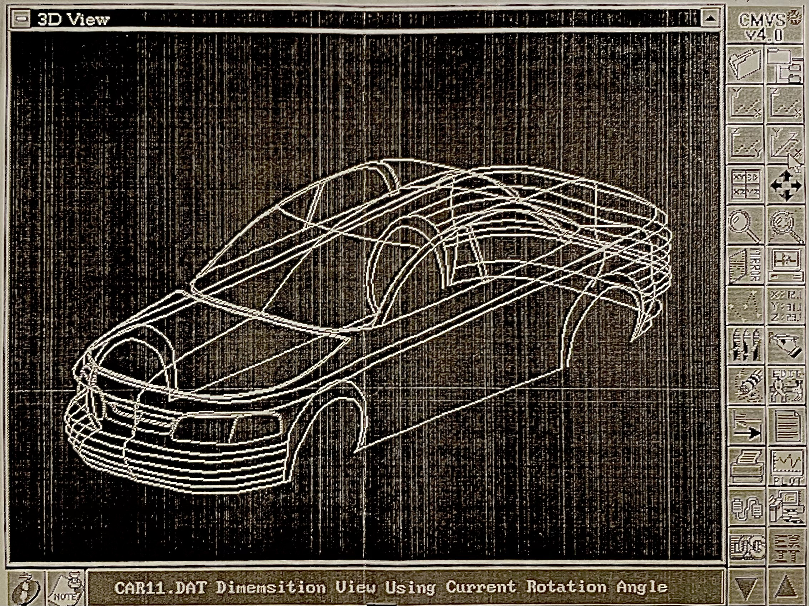
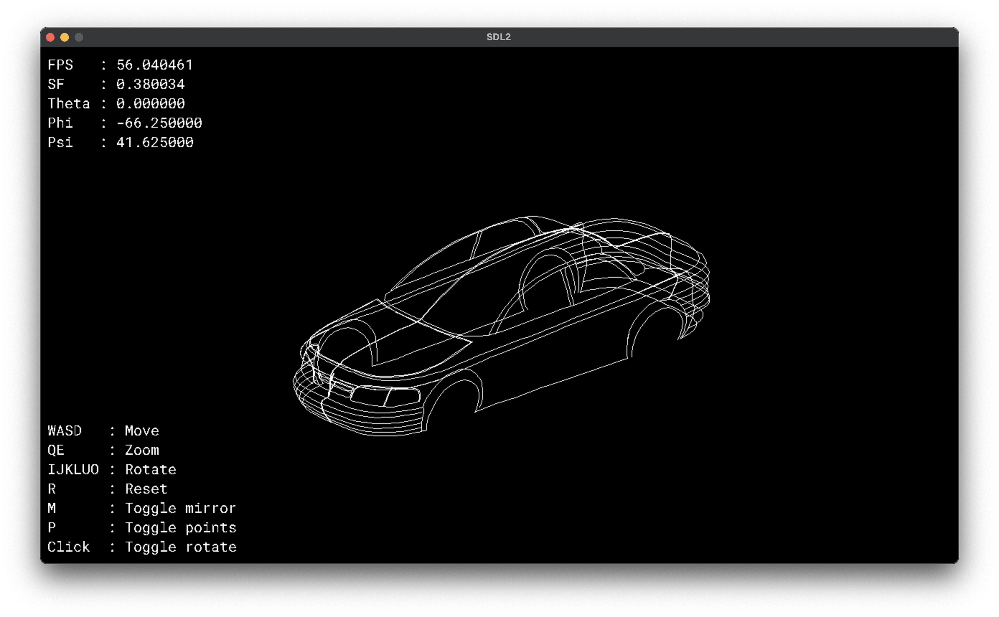

# Modern Coordinate Modification and Verification System

Video Demo (Click to YouTube):

# Table of Contents

- [Modern Coordinate Modification and Verification System](#modern-coordinate-modification-and-verification-system)
- [Table of Contents](#table-of-contents)
- [Introduction](#introduction)
  - [CMVS (1993)](#cmvs-1993)
  - [MCMVS (2023)](#mcmvs-2023)
- [TODO](#todo)
- [Technical Details](#technical-details)
- [Workspace](#workspace)

# Introduction

Modern Coordinate Modification and Verification System (MCMVS) is a modern rewrite of the Coordinate Modification and Verification System (CMVS) written by my father from 1988 to 1993. The original version was written in C for the DOS operating system, and leveraged the graphics mode of DOS to visualize 3D points and lines.

CMVS was written to assist car manufacterers in the design of car parts and car bodies when sculpting clay models.

MCMVS is written in C using SDL2, built and tested on an M2 Arm Macbook Pro.

## CMVS (1993)

CMVS as pictured above is version 4.0, the first shippable version. Although CMVS can still be ran on DOS systems as of 2023, it is unstable and limited to older hardware.

CMVS as written in the development notebook of 4.0 had the following functions:

- Simulaneously rendered 3D splines in X, Y, Z, and orthographic views
- Allowed the user to rotate the splines in 3D space by entering specific theta and phi values
- Allowed the user to move the splines in 3D space by entering specific X, Y, and Z values
- Allowed the user to zoom in and out of the splines in 3D space by entering specific zoom values
- Could show the user the X, Y, and Z values of a specific point
- Allowed mirroring of splines across either the X, Y, or Z axis with a user-specified offset
- Could color specific splines
- Create, erase, and edit specific vectors inside a spline
- Import/Export/Translation of `.DAT` files to `Drawing Exchange Format`(`DXF`) and `Initial Graphics Exchange Specification`(`IGES`) files
- Plotting of splines onto a printer communicating over a parallel port using `HPGL`
- Icon buttons with 3D effects and shading drawn in program
- Korean/English language support with a custom vector font for Korean characters
- Saving screen buffer areas that are overlapped when opening a button submenu to redraw when the submenu is closed

## MCMVS (2023)

MCMVS is a modern rewrite of CMVS, with the following features:

- Renders 3D splines in orthographic view
- Moves splines across X and Y axis with trackpad scroll or `WASD` keys
- Zooms in and out of splines with `SHIFT` + trackpad scroll
- Rotates splines in 3D space with `SHIFT` + trackpad or `IJKLUO` keys
- Mirror splines across Y axis plane with `m` key
- Show original spline vectors with `p` key
- Show X, Y, and Z views of object with `x`, `y`, and `z` keys

# TODO

MCMVS is still a work in progress as I had to learn graphics programming with SDL2, however the first version of MCMVS was created in a weekend.

- [ ] Allow creation, editing, and deletion of vectors in splines
- [ ] Allow import/export of `.DAT` files
- [ ] Allow coloring of specific splines

# Technical Details

A `.DAT` file contains splines made up of 3D point coordinates. When the program reads the `.DAT` file, it stores each spline into an array of splines.

A deeper explanation of the array of splines is a 2D array of pointers to spline arrays, where each spline array is an array of pointers to vectors.

The program then renders the splines in 3D space, and allows the user to rotate, move, and zoom the splines in 3D space.

To apply rotations, each vector in the spline undergoes a rotation matrix transformation. The rotation matrix is calculated using the theta, phi, and psi values modified by the user.

# Workspace

Note:

To fix the cubic spline interpolation lines failing to create a proper curve when points are overlapping, a distance modifier on the points is needed. On the plain points, calculate the distance between the points, and then create the cubic spline to follow the points sorted on distance.

Note:

Cubic spline interpolations cannot inherently fold a curve back on itself over the x axis. A different method needs to be used

Note:

Folding over the x axis can be solved by splitting the spline arrays when the x axis starts going backwards